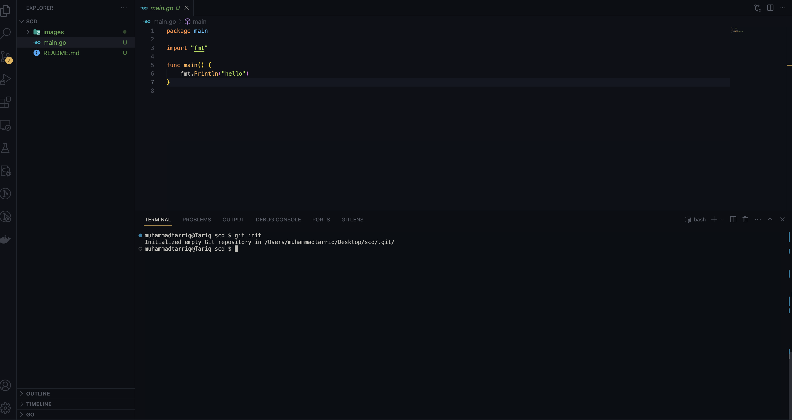
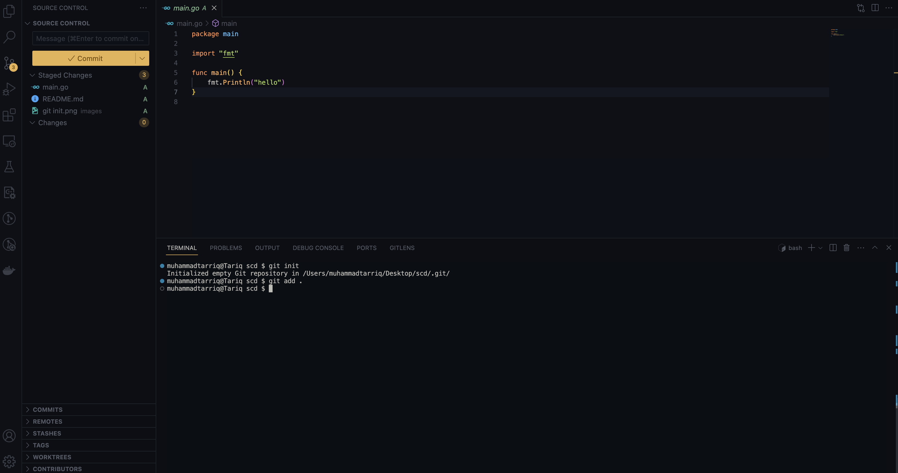
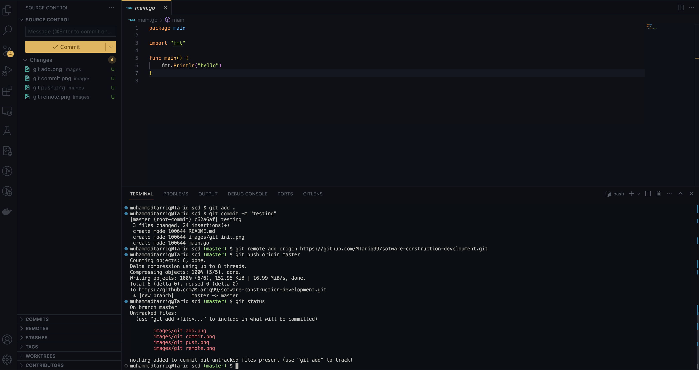
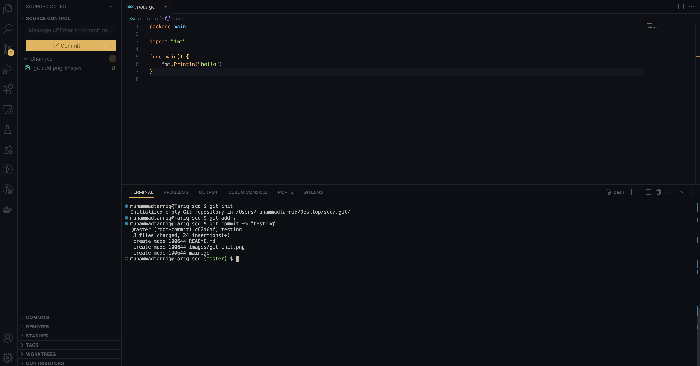
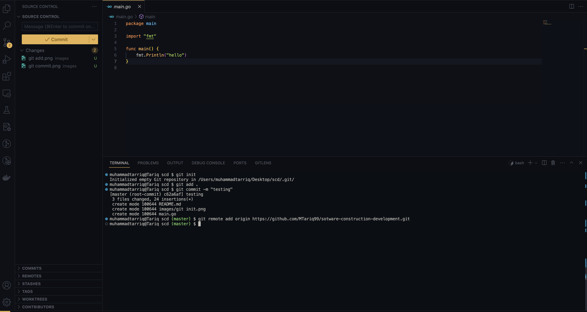
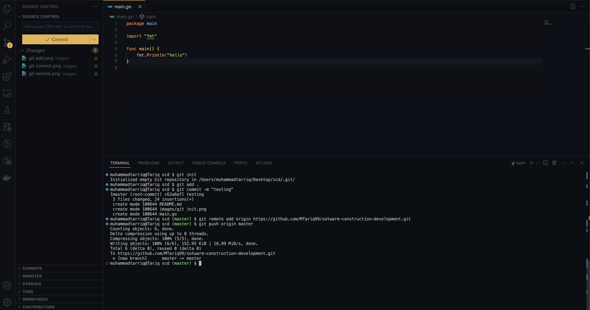
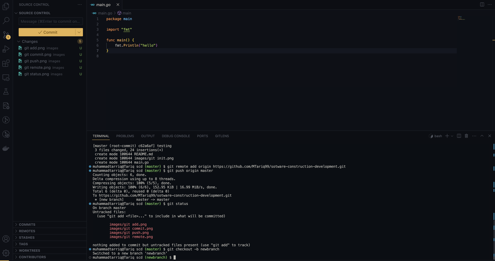
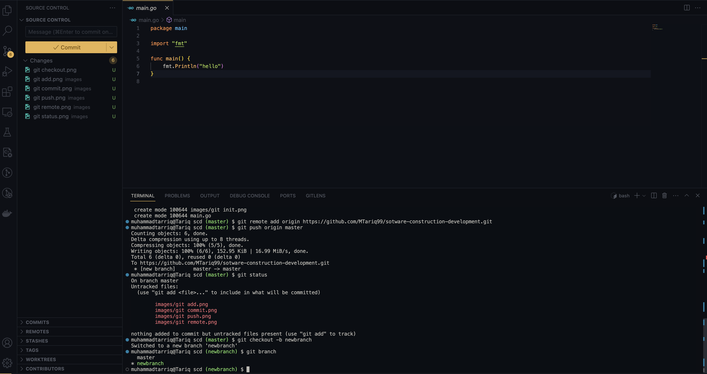
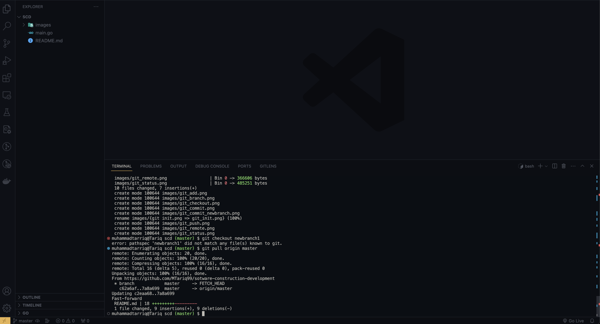
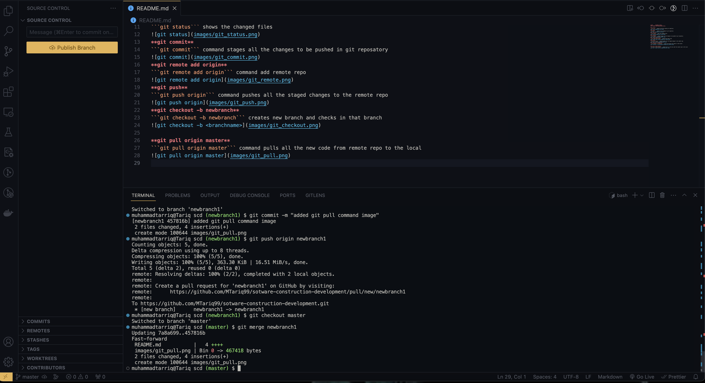

**NAME      MUHAMMAD TARIQ**
**REG NUMBER 4338-FBASE-BSSE-F21-B**

**git init**
```git init``` command initializes empty git repository

**git add**
```git add .``` addes all the changes to git repository

**git status**
```git status``` shows the changed files

**git commit**
```git commit``` command stages all the changes to be pushed in git reposatory

**git remote add origin**
```git remote add origin``` command add remote repo

**git push**
```git push origin``` command pushes all the staged changes to the remote repo

**git checkout -b newbranch**
```git checkout -b newbranch``` creates new branch and checks in that branch


**git branch**


**git pull origin master**
```git pull origin master``` command pulls all the new code from remote repo to the local


**git merge <branchname>**
```git merge <branchname>``` merges the branch in the master or main branch

